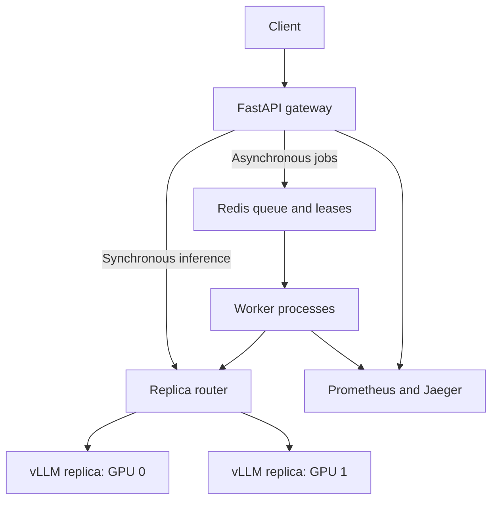

# Distributed Model Serving & Evaluation

A Python inference platform for learning, load testing, and measuring LLM serving behavior. FastAPI handles synchronous requests and asynchronous jobs; Redis coordinates workers; two independent vLLM replicas serve a 7B model on separate GPUs.

**Status:** runnable implementation with automated CPU tests. The default backend is a clearly labeled mock. GPU deployment and performance must be measured on your hardware. No claimed 420→690 tokens/s improvement or production usage is implied by this repository.

## Architecture



- Nonstreaming chat endpoint with per-process admission limits, timeouts, least-inflight routing, and failed-replica cooldown.
- Redis atomic queue admission, idempotent submissions, expiring leases, bounded crash retries, and token-fenced completion.
- vLLM continuous batching and prefix caching; explicit warmup requests to both replicas.
- Prometheus request, latency, output-token, in-flight, queue, and worker metrics. Optional OpenTelemetry inference and job spans exported to Jaeger.
- Batch client, closed-loop load generator, 200-case synthetic regression suite, baseline gates, and optional MLflow logging.

## Quick start: CPU / Mac demo

Install Docker with Compose, then:

```bash
git clone https://github.com/Ratmog/distributed-model-serving.git
cd distributed-model-serving
cp .env.example .env
docker compose up --build -d
curl http://localhost:8000/health/ready
curl http://localhost:8000/v1/chat/completions \
  -H 'Content-Type: application/json' \
  -d '{"messages":[{"role":"user","content":"Explain prefix caching"}]}'
```

The response has `"model":"mock"` and `"mock":true`. This backend echoes text with a small simulated delay; it does not run a language model. Mock token counts are whitespace counts and cannot establish GPU performance or model quality.

- Interactive API docs: http://localhost:8000/docs
- Prometheus: http://localhost:9090
- Jaeger traces: http://localhost:16686

Redis is private to the Compose network and persists jobs in an AOF volume. Services bind only to localhost. `docker compose down` retains jobs; `docker compose down -v` removes them.

For Python tools and tests:

```bash
python3 -m venv .venv
source .venv/bin/activate
pip install -e '.[dev]'
pytest -q
python scripts/batch.py data/batch.example.jsonl
python scripts/load_test.py --requests 500 --concurrency 16
```

Set `API_KEY` in `.env` to protect generation and job endpoints. Export the same value in the shell when running Python clients. For curl, include `Authorization: Bearer <your-key>`. Health and metrics remain unauthenticated; keep them on an internal network.

## Two-GPU deployment

Use a Linux host with two NVIDIA GPUs and NVIDIA Container Toolkit. Each replica holds a full copy of the model: this is replica/data-parallel serving, not tensor parallelism or distributed training. A 7B model in 16-bit precision uses roughly 14 GB just for weights; leave additional VRAM for KV cache and runtime overhead. Two 24 GB GPUs are a starting point to validate, not a measured guarantee.

```bash
docker compose -f compose.yaml -f compose.gpu.yaml up --build -d
# First model download and initialization can take several minutes.
docker compose -f compose.yaml -f compose.gpu.yaml logs -f vllm-0 vllm-1
curl http://localhost:8000/health/ready
```

The GPU override selects real inference for both API and worker. vLLM containers are internal. The model and image tag are configurable in `.env`; the default is explicitly pinned, not a claim of being the latest version. Validate the image against your CUDA driver. Refer to [vLLM's Docker guide](https://docs.vllm.ai/en/latest/deployment/docker/) and [OpenAI-compatible server documentation](https://docs.vllm.ai/en/latest/serving/openai_compatible_server/).

Health readiness requires Redis plus at least one responsive replica. It does not assert that a background worker is alive; watch queue depth, worker scrape status, and job progress. Warmup is best effort at process startup; if models are still loading, requests become usable when the replicas are healthy.

## API

| Endpoint | Behavior |
|---|---|
| `POST /v1/chat/completions` | Nonstreaming generation; 429 at capacity, 503 on backend failure/timeout |
| `POST /v1/jobs` | Returns 202 with job ID; optional `Idempotency-Key` header |
| `GET /v1/jobs/{id}` | Queued, running, succeeded, or failed; result when terminal |
| `GET /health/live` | Process liveness |
| `GET /health/ready` | Redis and replica availability |
| `GET /metrics` | Prometheus exposition |

Request fields: `messages`, `max_tokens` (1–2048), and `temperature` (0–2). The server selects the model. This is a chat-shaped API, not full OpenAI API compatibility; streaming, tool calls, and client-selected models are not implemented. Message character bounds do not guarantee the model's token context limit; oversized tokenized prompts can be rejected by vLLM.

Idempotency keys are scoped to the whole deployment. Reusing a key with a different payload returns 409. Active jobs remain until completion or retry exhaustion; terminal jobs and their keys expire after 24 hours by default. Resubmitting after expiry can execute again.

## Evaluation and load testing

```bash
# Run against the GPU backend. The mock should FAIL the quality gate.
python scripts/evaluate.py --output results/baseline.json
python scripts/evaluate.py --baseline results/baseline.json --output results/candidate.json
# Optional experiment tracking:
pip install -e '.[eval]'
python scripts/evaluate.py --mlflow

# Exercise overload and record failures, not just successful latency:
python scripts/load_test.py --requests 1000 --concurrency 100 --output results/load-100.json
```

Evaluation uses 200 synthetic addition prompts and exact-answer matching. It tests the regression pipeline, not broad reasoning, answer faithfulness, or real-world model quality. Replace it with a reviewed domain dataset before making those claims. Baseline comparisons require identical dataset hashes and gate accuracy loss and mean-latency growth. MLflow records quality, latency, model names, and output artifacts; it does not calculate infrastructure cost or GPU peak memory.

Load results include successful requests/s, backend-reported output tokens/s, success-only p50/p95/p99 end-to-end latency, and failure counts/rate. The generator is closed-loop and does not measure time-to-first-token or open-loop arrival behavior. It exits nonzero above the allowed error rate. For comparative runs record GPU/driver, vLLM image, model revision, input/output lengths, batch settings, replica count, and warmup conditions. See [benchmark protocol](docs/benchmarking.md).

## Operational boundaries

This is a single-tenant reference platform. Capacity is bounded globally for queued/leased jobs but independently per API/worker process for inference. Redis scripts assume standalone Redis (not Redis Cluster). Leases rely on reasonably synchronized worker clocks. Crashed work may run more than once; fenced completion protects stored results, not GPU compute consumption. The API does not immediately retry failed generation because the remote request may still be executing.

The default Compose setup has one worker process. Scale with `docker compose up -d --scale worker=2`; Prometheus's static worker target is intended for the single-worker demo and needs service discovery for reliable per-replica monitoring after scaling. GPU metrics are exposed by vLLM; the application does not measure physical peak VRAM. vLLM scrape targets being down in CPU mode is expected.

No external deployment, paid GPU rental, or measured GPU benchmark is performed by this repository. CI exercises tests, lint, Compose validation, and image construction; it does not run GPU inference.
